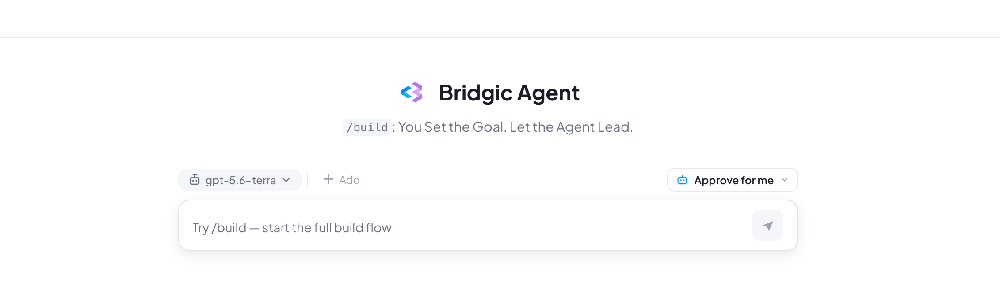

# Bridgic Agent

Bridgic Agent is a general-purpose, local-first desktop agent and an intelligent automation workflow builder. Designed around the principle of “Agent-Led, Not Human-Driven,” its unique `/build` command turns what you want into workflows that actually work—and keep working.

Build It. Run It. Evolve It!



## Core Features

### `/build` — Turn What You Want Into a Working Workflow

Tell Bridgic Agent what you want. It explores, builds, and verifies the workflow. **No automation expertise needed.**

### Agent-Led, Not Human-Driven

You set the goal. Bridgic Agent figures out the path, drives the task forward. It can keep progressing toward a successful result for **200+ rounds of exploration**.

### Ask for the Outcome, Not the Process

No need to manage the process — **no need to worry about skills and plugins**. Describe the goal, step in when needed, and review the result.

### Built to Run for the Long Term

**Build, run, modify, optimize, repair, and schedule** your workflows. Turn one successful automation into something that keeps running and evolving.

### Multi-Agent for Complex, Long-Running Work

Automatically break down complex tasks and run subagents in parallel. Launch them **from agents or scripts**, with high concurrency, long-running execution, and persistent interaction.

### Make It Truly Yours

Build around your needs instead of adapting to someone else's templates. Keep evolving your workflows into **private assets you own and control**.

## Install

### Install a release

Bridgic Agent currently supports macOS and Windows. Download the appropriate
installer from the [Releases](https://github.com/bitsky-tech/bridgic-agent/releases)
page: a `.pkg` file for macOS or an `.exe` file for Windows.

> **Note:** The Windows installer is not currently code-signed. If Windows
> blocks it, you may need to adjust the relevant settings in Windows Security and Smart App Control.

### Install from source

To run Bridgic Agent from source, install these prerequisites:

- Python `>=3.10,<3.14`
- [uv](https://docs.astral.sh/uv/)
- Bun 1.3.x
- Internet access the first time the managed Agent runtimes are prepared

Then install the Python and desktop dependencies once from the repository root:

```bash
uv sync
bun --cwd=desktop install
```

Run these setup commands again only when the corresponding dependencies change.

## Quick Start

### Start a release

Open Bridgic Agent from the Applications folder on macOS or the Start menu on
Windows. In Settings, configure a Model Provider and its credentials, then
begin your Bridgic Agent journey.

### Start from source

Run this command from the repository root:

```bash
bun --cwd=desktop run dev
```

The first launch may take a little longer while the required runtimes are
downloaded. When the app opens, configure a Model Provider and its credentials
in Settings, then begin your Bridgic Agent journey.

## Architecture

Bridgic Agent is powered by the Bridgic Amphibious runtime and adds its own durable
execution, Workspace, Workflow, scheduling, permission, local gateway, and
desktop experience. The product is designed around tasks and outcomes rather
than a single problem domain.

This repository contains the Python backend and the Electron desktop client:

```text
Bridgic Agent Desktop
        │
        ├── Electron desktop client + CLI interface
        │
Bridgic Agent Harness
        │
        └── bridgic-amphibious runtime + local database
```

Repository layout:

```text
src/
├── amphi_cli/       CLI and headless Agent client
├── amphi_service/   FastAPI/WebSocket gateway, scheduler, and runtime coordination
├── amphi_agent/     Agent loops, context, tools, Workflows, browser, and permissions
└── amphi_store/     Async SQLModel/SQLite records and repositories

desktop/
├── apps/electron/   Electron main, preload, renderer, and shared contracts
├── packages/        Shared UI and TypeScript workspace packages
└── scripts/         Development, runtime preparation, and packaging orchestration

build/               PyInstaller entry points and target-native build scripts
tests/               Python test suite
```

### Stage-aware Agent loops

Bridgic Agent does not expose one permanent, all-powerful tool list. The model
context and tool surface are assembled for the current stage:

- normal task execution uses the main Agent loop;
- delegated work uses a child-agent loop;
- Workflow authoring uses `clarify -> explore -> generate -> verify`;
- Workflow execution uses `execute`.

Independent tool calls from the same model response can run concurrently. A
root Session can have up to ten concurrent child agents; child agents cannot
recursively create another generation of child agents.

### Workspace and runtime isolation

Each root Session owns a managed Workspace under the application data root.
Its main working tree lives in `.work`; Workflow authoring and execution use
separate managed areas. Child agents keep separate turn histories while
sharing the root Session's Workspace.

After a completed root turn, Bridgic Agent records a private Git checkpoint
with Dulwich. Before restoring an older checkpoint it creates a protective
checkpoint. This protection covers Git-tracked Workspace content; external
mounts, active Workflow Run state, and ignored files are outside checkpoint
restore.

Agent commands prioritize application-managed, pinned uv, Python, and Node
runtimes, so unqualified invocations of those tools resolve consistently rather
than to the repository virtual environment or a host-installed version. A
sanitized host environment is appended so tools such as Git, shells, and
compilers can still be used. If the managed resources are not ready, the
gateway can start in a degraded state while the Agent environment is prepared
and retried in the background.

## Workflows and schedules

A Workflow separates repeatable execution knowledge from a single chat:

```text
Task
  -> Clarify
  -> Explore the real environment
  -> Generate WORKFLOW.md and supporting files
  -> Verify
  -> User save confirmation
  -> Saved Workflow

Saved Workflow
  -> Execute a fixed source snapshot in a Session Workspace
  -> Publish durable results
```

Workflows can be renamed, imported, exported as `.amphi-workflow`, run in a new
Session, referenced as context, or used to create a Schedule. Deleting the
saved Workflow does not invalidate runs that already captured their own source
snapshot.

Schedules use a six-field, seconds-first cron expression. Every trigger creates
an independent scheduled Session and records its outcome. The desktop client
supports run-now, editing and deleting definitions, pausing or resuming future
triggers, stopping individual runs, viewing history, and copying a completed
run into a new ordinary Session to continue from its context.

Scheduled Sessions run unattended in Full mode, but Full mode does not bypass
hard safety controls. If a run still requires user input or approval, it is
surfaced in the Approval Center and can produce a best-effort operating-system
notification.

## Embedded browser

Browser automation uses Chromium owned by the Electron application rather than
a downloaded standalone browser. The user and Agent therefore work with the
same visible tabs. Tabs and browser action queues are Session-scoped; cookies,
storage, and sign-in state live in one application-wide persisted profile
shared by all Sessions. Agent actions are performed through an authenticated
local browser controller and CDP.

The Agent can navigate, inspect structured page snapshots, interact with
referenced elements, fill forms, manage tabs, wait for page state, capture
screenshots, and verify results. Browser calls are serialized within one
Session, while different Sessions can operate independently.

The desktop browser controller must be running for browser tools to work. The
desktop application may remain in the system tray; no separate Chromium
fallback is bundled.

## Permission and security model

Bridgic Agent classifies a tool call by capability, target boundary, policy,
and execution mode:

| Mode | Behavior |
| --- | --- |
| **Request** | Ask before actions that require permission. |
| **Auto** | Automatically allow low-risk operations; route uncertain or sensitive operations through policy and safety review. |
| **Full** | Allow broad unattended execution while retaining hard denials and protections for credentials, uncertain deletion, and other critical cases. |

An explicitly allowed call can be remembered and reused for the exact same
signature within the current Session, and decisions are recorded for later
inspection. When optional safety classification is unavailable or
inconclusive, execution falls back to asking the user.

The gateway is designed as a local, single-user service. It binds to loopback
by default, limits trusted hosts and CORS to local clients, and generates a
bearer token at startup. Product REST routes require that token except for
health; the local OpenAPI documentation and schema remain public. WebSocket
clients authenticate in their first `hello` frame.

This permission model is **not an operating-system sandbox**. Bridgic Agent can
run commands and modify files with the permissions of the current OS user.
Review [SECURITY.md](SECURITY.md) before using it on sensitive data or systems.

Application state is local-first. Requests sent to a configured model Provider,
web access, and browser activity can still transmit data to the third parties
the user chooses. Optional pseudonymous telemetry is controlled from Settings.
See [PRIVACY.md](PRIVACY.md) for the data boundaries.

## Local data

The current product name and user-facing surfaces are Bridgic Agent. Some local
paths keep their original compatibility identifiers so upgrades continue to
find existing data.

| Path | Contents |
| --- | --- |
| `~/.bridgic/AmphiAgent/` | Backend database, runtime registration, logs, Sessions, attachments, Workflows, Workflow Runs, Skills, and managed runtime state. |
| `~/.bridgic/amphi/` | Desktop settings, drafts, logs, telemetry state, and cached showcase data. |

The current Memory store is an API and persistence foundation; automatic
long-term recall is not yet part of normal Agent execution.

## Current operating boundaries

- Bridgic Agent is a local desktop product, not a hosted or remote multi-user
  gateway.
- Browser tools require the desktop controller to remain running.
- Schedules require the local daemon to remain alive. Triggers missed while it
  is stopped are not replayed, and overlapping runs are currently allowed.
- The Home showcase is a preview surface; building or importing a Workflow is
  a separate explicit action.
- Durable Sessions and artifacts are implemented today; automatic long-term
  memory recall is not.

## Releasing

Installers are built and published by the `Package` workflow
(`.github/workflows/package.yml`); its header comment carries the full
rationale. Only two things reach that workflow — a tag push and a manual run.
Ordinary pushes and pull requests build nothing.

**A tag is a delivery, not a checkpoint.** A normal release becomes
`/releases/latest`, which is exactly the endpoint every installed client
resolves on its next update check. GitHub excludes prereleases from it, so a
prerelease reaches no one automatically.

### Publish a release

The version lives in four files, and the workflow refuses a tag that disagrees
with `desktop/package.json` — artifacts are named from that file, so a mismatch
publishes a release no client can update to. One command writes all four:

```bash
bun --cwd=desktop run set-version 0.1.3
git commit -am "chore: release 0.1.3"
git tag 0.1.3 && git push origin 0.1.3
```

Tags are bare semver with no `v` prefix:

| Tag | Result |
| --- | --- |
| `0.1.3` | Normal release, delivered to installed clients. |
| `0.1.3-rc1` | Prerelease — any tag containing `-` is one. |
| `v0.1.3` | Matches no trigger; nothing runs. |

A tag push always builds the full matrix — macOS arm64, macOS x64, and Windows
x64 — and always runs the Windows installer smoke suite.

### Build without releasing

Run the workflow by hand (Actions -> Package -> Run workflow) for an internal
build:

| Input | Default | Effect |
| --- | --- | --- |
| `release_tag` | empty | Empty publishes a prerelease under `nightly-<UTC yyyymmdd-hhmm>`. A bare semver publishes a normal release under that tag instead. |
| `platform` | `all` | `all`, `macos` (arm64 only), `macos-intel`, or `windows`. |
| `smoke` | off | The Windows installer E2E suite (~25 min). Required when `installer.nsh`, `test-installer.ps1`, or `electron-builder.yml` changed. |

A nightly skips both release guards. Setting `release_tag` does not: the
version must match, and `platform` must stay `all`, because the two macOS
update manifests are merged only when every platform job succeeds — a narrowed
run publishes a release no installed client can consume.

Releases accumulate and nothing expires them; prune with
`gh release delete <tag> --cleanup-tag`.

## License

The source is licensed under the
[GNU Affero General Public License v3.0](LICENSE). Because the AGPL's §13
network clause applies, running a modified version as a network service
obliges you to offer that version's source to its users.

A commercial license is available as the alternative to those copyleft terms. Contact <bd@bitsky-tech.com>.

Third-party components retain their own license terms. [NOTICE](NOTICE)
records the elections, source offers, and corrections that cannot be derived
from package metadata; the complete component list with full license texts is
generated at build time into `THIRD-PARTY-LICENSES.txt` and ships inside the
installed application.

**The AGPL does not cover the whole tree.** `src/amphi_agent/builtin_skills/`
holds Skill packages vendored into the repository, and a `LICENSE.txt` inside
one of those directories governs that directory and takes precedence over this
license. Some of them are not open source at all. [NOTICE](NOTICE) §8 lists
every one and what applies to it — read it before reusing anything from that
subtree.

Copyright (c) 2026 BitSky-Tech Inc.
