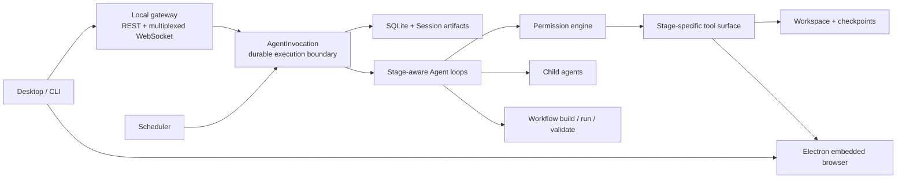

# Bridgic Agent

Bridgic Agent is a general-purpose, local-first desktop agent for carrying work
from an initial request to a durable result. It can work with local files and
commands, use the web and an embedded browser, delegate to child agents, turn a
successful process into a reusable Workflow, and run that Workflow on a
schedule.

It is powered by the Bridgic Amphibious runtime and adds its own durable
execution, Workspace, Workflow, scheduling, permission, local gateway, and
desktop experience. The product is designed around tasks and outcomes rather
than a single problem domain.

This repository contains the Python backend and the Electron desktop client:

```text
Bridgic Agent Desktop
        │
        ├── local REST + multiplexed WebSocket
        │
Python gateway and Agent runtime
        │
        └── SQLite records + Session-owned artifacts
```

> Bridgic Agent is under active development. The current release line is
> pre-1.0, so internal contracts may still evolve.

## What Bridgic Agent can do

- **Handle general tasks with real tools.** Work with files, directories,
  shell commands, web search, web pages, and structured human input.
- **Keep work durable.** Sessions, completed or parked turn traces,
  attachments, approvals, Workflows, schedules, and results survive client and
  daemon restarts. The live event stream itself is process-local.
- **Work in a managed Workspace.** Each root Session gets a managed working area
  with mounted resources, change inspection, and private Git checkpoints for
  the tracked Workspace content.
- **Share a browser with the user.** The Agent operates the same embedded
  Chromium tabs the user can see. Tabs belong to a Session, while cookies,
  storage, and sign-in state use one persisted browser profile shared across
  the application.
- **Delegate work.** A root Session can run child agents concurrently while
  keeping their histories and results visible in the parent experience.
- **Build reusable Workflows.** Bridgic Agent can clarify a task, explore the
  real execution path, generate a Workflow, verify it, and ask the user to
  accept it.
- **Run and validate Workflows.** Every run uses a fixed source snapshot,
  persists its Workflow cursor, applies its validation policy, and publishes
  reusable result artifacts.
- **Automate recurring work.** Six-field cron schedules can start independent
  runs, retain history, and surface runs that still need human attention.
- **Extend the Agent.** Skills can be installed and enabled on demand, while
  model Providers and compatible custom channels are configured in the UI.
- **Keep the user in control.** Three execution modes, inline permission cards,
  and hard safety rules govern tool execution; decisions are recorded in a
  per-Session audit trail.

## Product model

| Concept | Role |
| --- | --- |
| **Session** | A durable conversation and execution history. Root Sessions can own child-agent Sessions. |
| **Workspace** | The Session's managed files, mounts, private checkpoints, Workflow authoring area, and run artifacts. |
| **Workflow** | A reusable package containing execution instructions, a validation policy, and supporting files. |
| **Workflow Run** | A Session-local execution of a fixed Workflow snapshot, with a resumable cursor and published results. |
| **Schedule** | A persistent cron definition that creates independent scheduled Sessions and keeps their run history. |
| **Skill** | An installable capability package loaded only when relevant to the current task. |

The desktop client exposes these concepts directly. Its left navigation covers
Home, Workflows, Skills, Schedules, Assets, the Session tree, gateway state, and
scheduled runs that need attention. A Session's right-hand workbench brings
together Files, Workflows, Results, Schedules, and Browser tabs.

The composer is also context-aware:

- `/` starts commands, Skills, Workflows, and schedules.
- `@` references Session files, Workflows, run results, and schedules as input.
- Permission decisions, task specifications, child-agent activity, Workflow
  build progress, and run results stay inline with the Session timeline.

The desktop client is localized in English and Chinese.

## Architecture



### A durable execution boundary

`AgentInvocation` is the lifecycle boundary for a run. It restores the durable
Session, prepares its Workspace and current catalogs, starts the appropriate
Agent stage, streams events to connected clients, and persists completed,
parked, failed, or cancelled turn state. Live WebSocket event buffers do not
survive a daemon restart; a Workflow Run additionally persists its own cursor.

When execution must pause for permission, clarification, task acceptance,
Workflow confirmation, or child-agent input, the parked interaction is stored.
The next response resumes the same logical turn instead of constructing an
unrelated request.

### Stage-aware Agent loops

Bridgic Agent does not expose one permanent, all-powerful tool list. The model
context and tool surface are assembled for the current stage:

- normal task execution uses the main Agent loop;
- delegated work uses a child-agent loop;
- Workflow authoring uses `clarify -> explore -> generate -> verify`;
- Workflow execution uses `execute -> validate`.

Independent tool calls from the same model response can run concurrently. A
root Session can have up to ten concurrent child agents; child agents cannot
recursively create another generation of child agents.

### Workspace and runtime isolation

Each root Session owns a managed Workspace under the application data root.
Its main working tree lives in `.work`; Workflow authoring and execution use
separate managed areas. Child agents keep separate turn histories while
sharing the root Session's Workspace.

After a completed root turn, Bridgic Agent records a private Git checkpoint
with Dulwich. Before restoring an older checkpoint it creates a protective
checkpoint. This protection covers Git-tracked Workspace content; external
mounts, active Workflow Run state, and ignored files are outside checkpoint
restore.

Agent commands prioritize application-managed, pinned uv, Python, and Node
runtimes, so unqualified invocations of those tools resolve consistently rather
than to the repository virtual environment or a host-installed version. A
sanitized host environment is appended so tools such as Git, shells, and
compilers can still be used. If the managed resources are not ready, the
gateway can start in a degraded state while the Agent environment is prepared
and retried in the background.

## Workflows and schedules

A Workflow separates repeatable execution knowledge from a single chat:

```text
Task
  -> Clarify
  -> Explore the real environment
  -> Generate WORKFLOW.md, VALIDATE.md, and supporting files
  -> Verify
  -> User acceptance
  -> Saved Workflow

Saved Workflow
  -> Execute a fixed source snapshot in a Session Workspace
  -> Validate when requested
  -> Publish durable results
```

Workflows can be renamed, imported, exported as `.amphi-workflow`, run in a new
Session, referenced as context, or used to create a Schedule. Deleting the
saved Workflow does not invalidate runs that already captured their own source
snapshot.

Schedules use a six-field, seconds-first cron expression. Every trigger creates
an independent scheduled Session and records its outcome. The desktop client
supports run-now, editing and deleting definitions, pausing or resuming future
triggers, stopping individual runs, viewing history, and copying a completed
run into a new ordinary Session to continue from its context.

Scheduled Sessions run unattended in Full mode, but Full mode does not bypass
hard safety controls. If a run still requires user input or approval, it is
surfaced in the Approval Center and can produce a best-effort operating-system
notification.

## Embedded browser

Browser automation uses Chromium owned by the Electron application rather than
a downloaded standalone browser. The user and Agent therefore work with the
same visible tabs. Tabs and browser action queues are Session-scoped; cookies,
storage, and sign-in state live in one application-wide persisted profile
shared by all Sessions. Agent actions are performed through an authenticated
local browser controller and CDP.

The Agent can navigate, inspect structured page snapshots, interact with
referenced elements, fill forms, manage tabs, wait for page state, capture
screenshots, and verify results. Browser calls are serialized within one
Session, while different Sessions can operate independently.

The desktop browser controller must be running for browser tools to work. The
desktop application may remain in the system tray; no separate Chromium
fallback is bundled.

## Permission and security model

Bridgic Agent classifies a tool call by capability, target boundary, policy,
and execution mode:

| Mode | Behavior |
| --- | --- |
| **Request** | Ask before actions that require permission. |
| **Auto** | Automatically allow low-risk operations; route uncertain or sensitive operations through policy and safety review. |
| **Full** | Allow broad unattended execution while retaining hard denials and protections for credentials, uncertain deletion, and other critical cases. |

An explicitly allowed call can be remembered and reused for the exact same
signature within the current Session, and decisions are recorded for later
inspection. When optional safety classification is unavailable or
inconclusive, execution falls back to asking the user.

The gateway is designed as a local, single-user service. It binds to loopback
by default, limits trusted hosts and CORS to local clients, and generates a
bearer token at startup. Product REST routes require that token except for
health; the local OpenAPI documentation and schema remain public. WebSocket
clients authenticate in their first `hello` frame.

This permission model is **not an operating-system sandbox**. Bridgic Agent can
run commands and modify files with the permissions of the current OS user.
Review [SECURITY.md](SECURITY.md) before using it on sensitive data or systems.

Application state is local-first. Requests sent to a configured model Provider,
web access, and browser activity can still transmit data to the third parties
the user chooses. Optional pseudonymous telemetry is controlled from Settings.
See [PRIVACY.md](PRIVACY.md) for the data boundaries.

## Quick start

### Prerequisites

- Python `>=3.10,<3.14`
- [uv](https://docs.astral.sh/uv/)
- Bun 1.3.x
- Internet access the first time the managed Agent runtimes are prepared

From the repository root:

```bash
uv sync

cd desktop
bun install
bun run dev
```

`bun run dev` prepares the pinned uv, Python, and Node resources, builds the
Electron main and preload processes, starts the renderer development server,
and launches Electron. Electron discovers and adopts an existing compatible
daemon or starts one through the backend CLI.

Model Providers, credentials, the active model, and the execution mode are
configured in the desktop Settings UI. Root `.env` values are for Python
process configuration; `desktop/.env` values are for desktop development and
packaging.

### Debug the backend in the foreground

Prepare the managed runtimes, then start the daemon from the repository root:

```bash
cd desktop
bun run dev:resources

cd ..
uv run amphi server serve --log-level debug
```

In another terminal:

```bash
cd desktop
bun run dev
```

The desktop client will reuse the foreground daemon.

> **Naming note.** The product is **Bridgic Agent**, on both the desktop and
> the backend side. Several identifiers still spell an earlier name, and they
> are kept deliberately: each one is a contract held by something outside this
> repository — an installed copy, the operating system, or the packaging
> toolchain — so renaming it would orphan existing data rather than relabel it.
>
> | Identifier | What it is |
> | --- | --- |
> | `amphi` | the backend CLI, and the `amphi://` deep-link scheme |
> | `AMPHI_*` | environment variables read by the backend process |
> | `~/.bridgic/AmphiAgent/`, `~/.bridgic/amphi/` | on-disk data roots |
> | `src/amphi_agent/`, `src/amphi_cli/`, … | Python package names |
> | `dist/amphi/` | the PyInstaller output directory |
>
> The Python distribution is `bridgic-agent`, matching the product, and its
> environment variables use the matching `BRIDGIC_AGENT_*` prefix.
>
> `desktop/apps/electron/src/shared/app-meta.ts` is the single source of truth
> for the names the desktop uses, and `desktop/scripts/check-naming.sh` fails
> the build if one of them is re-declared as a bare literal elsewhere.

## Backend CLI

Use `uv run amphi` in a source checkout unless the virtual environment is
already activated.

```bash
uv run amphi server start
uv run amphi server status
uv run amphi server stop
uv run amphi server restart

# Supported on macOS and Windows
uv run amphi server autostart enable
uv run amphi server autostart status
uv run amphi server autostart disable

# Runs a self-contained task in a new Session; requires a running daemon
uv run amphi agent run "Summarize the key tradeoffs of local-first software"
```

`server serve --reload` is available for low-level Uvicorn development, but it
does not register a managed gateway in `runtime.json` and cannot be adopted by
the desktop client. Linux autostart registration is not currently supported.

The default endpoint is `127.0.0.1:7421`, but clients should discover the
actual endpoint and token from `runtime.json` rather than hard-code either
value. Do not expose the gateway as a remote multi-user service.

When the daemon is running, REST OpenAPI documentation is available at
`/docs`. The API covers user and Provider settings, Sessions, messages, files,
mounts, gateway state, Agent runs, child agents, browser control, Skills,
Workflows, Workflow Runs, and schedules. Real-time tokens, reasoning, tools,
stage progress, human interactions, results, and system events share one
authenticated multiplexed WebSocket connection.

## Development commands

From the repository root:

```bash
uv run pytest
```

From `desktop/`:

```bash
bun run dev
bun run typecheck
bun run lint
bun run test
bun run check:naming
bun run check:locales
```

## Packaging

Desktop packaging is a two-stage, target-native process. First build the Python
backend for the target operating system **and architecture**:

```bash
# macOS or Linux
bash build/build-pyinstaller.sh
```

```powershell
# Windows PowerShell
.\build\build-pyinstaller.ps1
```

This produces the onedir backend bundle in `dist/amphi/`. PyInstaller does not
cross-compile across operating systems or convert architectures. For example,
a macOS x64 desktop package must contain an x64 backend built with a matching
toolchain; an arm64 backend built on Apple Silicon cannot be reused for it.

Then build the desktop package from `desktop/`:

```bash
bun run dist:mac       # macOS arm64: .pkg + updater .zip
bun run dist:mac:x64   # macOS x64: .pkg + updater .zip
bun run dist:linux     # Linux x64: .deb
bun run dist:win       # Windows x64: NSIS .exe
```

The `dist:*` commands copy the already-built backend and prepare the matching
managed runtimes; they do not run PyInstaller for you. Desktop artifacts are
written to `desktop/apps/electron/release/`.

Local macOS packaging requires Xcode Command Line Tools. Production macOS
distribution also requires signing and notarization. The update source is
disabled unless `APP_UPDATE_URL` is configured in `desktop/.env` or CI before
the desktop bundle is built. Current Windows packages are unsigned and may
trigger a SmartScreen warning.

## Releasing

Release builds come from the `Package` workflow
([`.github/workflows/package.yml`](.github/workflows/package.yml)). It has two
entry points and nothing else triggers it — ordinary pushes and pull requests
do not.

### Pushing a version tag

A tag matching bare semver starts a full release build:

```
0.1.14        builds every platform, publishes a normal release
0.1.14-rc1    builds every platform, publishes a PRERELEASE
v0.1.14       does not match the trigger; nothing runs
```

A tag push always builds macOS arm64, macOS x64, and Windows x64, and always
runs the Windows installer smoke suite.

### Running the workflow manually

`workflow_dispatch` takes three inputs:

| Input | Default | Effect |
| --- | --- | --- |
| `platform` | `all` | `all` (arm64 + Intel + Windows), or one of `macos` (arm64 only), `macos-intel`, `windows`. |
| `smoke` | `false` | Runs the Windows installer end-to-end suite. Required when `installer.nsh`, `test-installer.ps1`, or `electron-builder.yml` changed. |
| `release_tag` | empty | Publishes a normal release under this tag instead of a nightly prerelease. |

Without `release_tag`, a manual run publishes a prerelease tagged
`nightly-<UTC timestamp>`, so repeated runs accumulate instead of overwriting
each other.

### Which builds reach existing users

**A normal release is a delivery.** Installed clients resolve updates through
`/releases/latest`, so publishing one hands that build to every user on their
next check — there is no staged rollout. Tagging is shipping.

**A prerelease is not.** GitHub excludes prereleases from `/releases/latest`,
so `-rc` tags and nightly builds are downloadable from the Releases page but
invisible to the updater. Use them to rehearse a release without delivering it.

Auto-update is off entirely unless `APP_UPDATE_URL` is set at build time; CI
sets it, local builds do not.

Releases are never pruned automatically. Remove old nightlies by hand with
`gh release delete <tag> --cleanup-tag`.

## Local data

The current product name and user-facing surfaces are Bridgic Agent. Some local
paths keep their original compatibility identifiers so upgrades continue to
find existing data.

| Path | Contents |
| --- | --- |
| `~/.bridgic/AmphiAgent/` | Backend database, runtime registration, logs, Sessions, attachments, Workflows, Workflow Runs, Skills, and managed runtime state. |
| `~/.bridgic/amphi/` | Desktop settings, drafts, logs, telemetry state, and cached showcase data. |

The current Memory store is an API and persistence foundation; automatic
long-term recall is not yet part of normal Agent execution.

## Repository layout

```text
src/
├── amphi_cli/       CLI and headless Agent client
├── amphi_service/   FastAPI/WebSocket gateway, scheduler, and runtime coordination
├── amphi_agent/     Agent loops, context, tools, Workflows, browser, and permissions
└── amphi_store/     Async SQLModel/SQLite records and repositories

desktop/
├── apps/electron/   Electron main, preload, renderer, and shared contracts
├── packages/        Shared UI and TypeScript workspace packages
└── scripts/         Development, runtime preparation, and packaging orchestration

build/               PyInstaller entry points and target-native build scripts
tests/               Python test suite
```

## Current operating boundaries

- Bridgic Agent is a local desktop product, not a hosted or remote multi-user
  gateway.
- Browser tools require the desktop controller to remain running.
- Schedules require the local daemon to remain alive. Triggers missed while it
  is stopped are not replayed, and overlapping runs are currently allowed.
- The Home showcase is a preview surface; building or importing a Workflow is
  a separate explicit action.
- Durable Sessions and artifacts are implemented today; automatic long-term
  memory recall is not.

## License

The source is licensed under the
[GNU Affero General Public License v3.0](LICENSE). Because the AGPL's §13
network clause applies, running a modified version as a network service
obliges you to offer that version's source to its users.

A commercial license is available as the alternative to those copyleft terms.
Ask at <bd@bitsky-tech.com>.

Third-party components retain their own license terms. [NOTICE](NOTICE)
records the elections, source offers, and corrections that cannot be derived
from package metadata; the complete component list with full license texts is
generated at build time into `THIRD-PARTY-LICENSES.txt` and ships inside the
installed application.

**The AGPL does not cover the whole tree.** `src/amphi_agent/builtin_skills/`
holds Skill packages vendored into the repository, and a `LICENSE.txt` inside
one of those directories governs that directory and takes precedence over this
license. Some of them are not open source at all. [NOTICE](NOTICE) §8 lists
every one and what applies to it — read it before reusing anything from that
subtree.

Copyright (c) 2026 BitSky-Tech Inc.